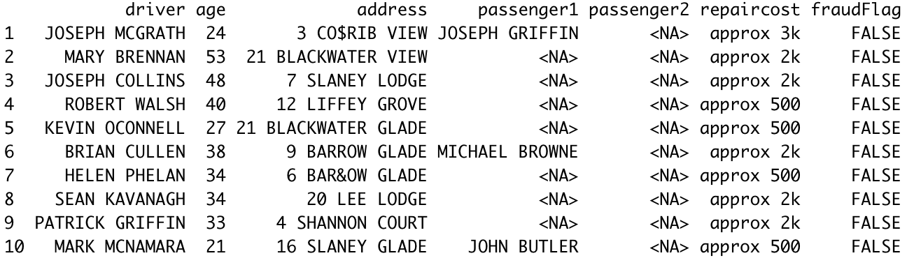
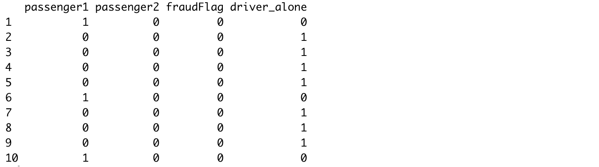
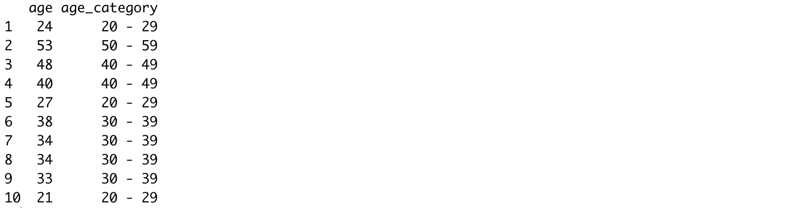
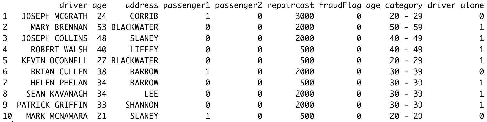

```{r setup, include= FALSE}
knitr::opts_chunk$set(
    echo = FALSE,
    message = FALSE,
    warning = FALSE,
    out.width = "100%",
    out.height = "500px",
    fig.align = "center")
```


```{r}
library(knitr)
library(bookdown)
library(corrplot)
library(tidyverse)
library(lubridate)
library(recipes)
library(skimr)
library(data.table)
library(forcats)

```

```{r}
dataassignment_tbl <- read_csv("assignment_data.csv")
```

```{r}

df_toanalyse <- dataassignment_tbl %>%

    mutate(repaircost = as_factor(repaircost),
           passenger1 = as_factor(passenger1),
           passenger2 = as_factor(passenger2)) %>% 
    
    mutate(passenger1 = ifelse(is.na(passenger1), 0, 1),
           passenger2 = ifelse(is.na(passenger2), 0, 1)
    ) %>%
    
    separate(col = address, 
             into = c("addressdull", "address", "address_1"), 
             sep = " ",
             remove = TRUE) %>% 
    select(-addressdull, -address_1) %>%
    
    mutate(address = address %>% str_replace_all("[0-9[:punct:]!@£$%^&*()+_~=]", ""),
           repaircost = repaircost %>% str_replace_all("k", "000"),
           repaircost = repaircost %>% str_remove_all("[a-z[:punct:]]")) %>% 
    
    mutate(driver = driver %>% str_replace_all("[0-9[:punct:]!@£$%^&*()+_~=]", "")) %>% 
    
    mutate(address = case_when(
        address %like% "^CO" ~ "CORRIB",
        address %like% "^SH" ~ "SHANNON",
        address %like% "^LI" ~ "LIFFEY",
        address %like% "^LF" ~ "LIFFEY",
        address %like% "^BL" ~ "BLACKWATER",
        address %like% "^LEE" ~ "LEE",
        address %like% "^SL" ~ "SLANEY",
        address %like% "^BA" ~ "BARROW",
        address %like% "^SU" ~ "SUIR",
        address %like% "^CA" ~ "CAMAC",
        address %like% "^DOD" ~ "DODDER",
        address %like% "^SA" ~ "SAVERN",
        address %like% "^TH" ~ "THAMES",
        address %like% "^BO" ~ "BOYNE",
        address %like% "^BN" ~ "BOYNE",
        address %like% "^SE" ~ "SERN",
        address %like% "^TH" ~ "THAMES",
        address %like% "^TM" ~ "THAMES",
        TRUE ~ address
        )) %>% 
    mutate(address = as_factor(address)) %>% 
    
    drop_na() %>% 
    
    mutate(repaircost = case_when(
        repaircost == "5" ~ "500",
        repaircost == "0" ~ "500",
        repaircost == "2" ~ "500",
        TRUE ~ repaircost
    )) %>% 

    mutate(driver = case_when(
        driver %like% "^SHE" ~ "SHEEHAN",
        driver %like% "^OCONNE" ~ "OCONNEL",
        driver %like% "^HG" ~ "HIGGINS",
        TRUE ~ driver
    )) %>%     
    
    mutate(age_category =
               case_when(age <= 29 ~ "20 - 29", 
                         age <= 39 ~ "30 - 39",
                         age <= 49 ~ "40 - 49",
                         age <= 59 ~ "50 - 59",
                         age <= 69 ~ "60 - 69",
                         age <= 79 ~ "70 - 79",
                         age <= 90 ~ "80 - 89",)) %>% 
    
# 4.0 Feature Engineering -------------------------------------------------

    
    mutate(fraudFlag = case_when(
        fraudFlag == "TRUE" ~ 1,
        TRUE ~ 0)) %>% 
    
    mutate(driver_alone = case_when(
            passenger1 == 0 & passenger2 == 0 ~ 1,
            TRUE ~ 0)) 
  
```

# Problem Statement

I have been tasked to identify key features of fraud for a insurance company. Exploratory Data Analysis (EDA) is a key process in the development of the model to understand the range of improper activities which a person may commit in order to achieve a favorable outcome from the insurance company. \
This could range from staging the incident, this takes into consideration two analysis: 
\
1. Areas where the accident happened and the number of passengers; 
2. Age analysis to determine if there is a particular group whom is more likely to commit fraud; 
3. the extent of damage, analysing how often claims were ruled as fraud in relation to the repair cost.

# Solution Summary

The data analysis team has identified four key areas to aid model development:

1. Undertake some __data preparation__ tasks to ensure the quality of data, this includes using  __Feature engineering__ to improve model performance;

2. Develop a range of __exploratory data visualisations__ to understand the factors of insurance fraud;

3. __Conclusions__ to summarise findings. 


# Data Preparation

A range of data preparations tasks were necessary to ensure accuracy, completeness and consistence of the data allowing us to use the highest quality data in our analysis.

The raw data set was messy and inconsistent, issues such as special characters and string mixed with numerical values in the same column throughout the data set as you can see below:
\
\
\
\

```{r}

```

The data preparation phase consisted of the following tasks:

* Clean the unnecessary information. An example of unnecessary data can be seen in the repair cost column. I.e.: "approx" and "k" after the cost. 
* Remove special characters and unnecessary information in the address column, for example, the number and the second part of the address. It was required in order to be able to analyse fraud pattern though addresses.
* Special characters had to be dealt with in 3 rows in the driver's column as well.


## Engineered Features

The first step was to create binary encoded columns. i.e.: "1" for yes and "0" for no. Predictive models need to have the data coded this way to make accurate predictions. Some of the EDA were taken from binary encoded columns.\
The outcome of the task mentioned above is shown below:\

```{r}

```

The second step was to categorize via binning the age column, creating a new column called "age_category". This would help us understanding if there is a particular group whom is more likely to commit fraud.\
The output of the task mentioned above is shown below: 
\
\
```{r}

```
\
\
Upon finishing all the tasks in the __Data preparation__ and __feature engineering__, the data set is now in a great format to start modelling.\
The outcome of the tasks performed can be seen below:
\

```{r}

```


# Exploratory Data Analysis

Exploratory Data Analysis (EDA) is critical and allows us to perform initial investigations on data so as to discover patterns, spot anomalies, test hypothesis and to check assumptions with the help of summary statistics and graphical representations. The visualizations shown in this section will identify patterns of the frauds detected in the data set.
\

```{r echo=FALSE, fig.cap = "Correlation between the number of passengers and frauds flagged"}
test_corr <- df_toanalyse %>% select(fraudFlag, passenger1, passenger2, driver_alone)

firstcor <- cor(test_corr)

corrplot(firstcor, method = 'circle', type = 'lower', insig='blank',
         addCoef.col ='black', addgrid.col = "grey", tl.srt = 45, 
         number.cex = 0.8, tl.col ="black", order = 'AOE', diag=FALSE)

```
  \
    

* There is a strong correlation between passenger2 and fraudFlag, which indicates that most of the frauds detected were from claims where there were 2 passengers in the car. Other correlations that exist are weaker but still notable.
\

```{r echo=FALSE, fig.cap = "Comparison of the number of frauds per address of the driver."}

ggplot(data = df_toanalyse, aes(x = address, y = fraudFlag)) +
    geom_col(aes(fill = address)) +
    scale_x_discrete(guide = guide_axis(angle = 90)) +
    labs(title = "FRAUDS FLAGGED BY AREA", 
         subtitle = "Number of insurance frauds grouped by area") +
    labs(x = "DRIVER'S AREA", y = "NUMBER OF FRAUDS FLAGGED", fill = "AREA") +
    theme_minimal()

```
\
* The graph above shows the amount of claims made by drivers from certain areas, it clearly shows that drivers from __Sern__ holds the larger share, accounting for __32%__ of the total of frauds flagged, followed by __Thames__ with __25%__ and __Shannon__ with __18%__, highlighting that for the future claims made from drivers from this area will require further investigation. 
\
```{r echo=FALSE, fig.cap = "Comparison of the number of frauds per age group."}
ggplot(data = df_toanalyse, aes(x = age_category, y = fraudFlag)) +
    geom_col(aes(fill = age_category)) +
    theme_classic() +
    labs(title = "FRAUDS FLAGGED BY AGE GROUP", 
         subtitle = "Count of frauds by age group",
         fill = "AGE GROUP") +
    labs(x = "AGE GROUP", y = "NUMBER OF FRAUDS FLAGGED")

```
\
As the graph above shows, the larger share of the frauds belongs to the __30 to 39__ years old group, accounting for __43%__ of the total, follwed by the __20 to 29__ years old with __37%__, __40 to 49__ years old with __11%__ and then __50 to 59__ years old with only __9%__ of the total. Normally in the insurance world, the policy would be much more expensive for younger people, but with this number of frauds being commited by an older group, it requires some reevaluation.


```{r echo=FALSE, fig.cap = "Comparison of the number of frauds per repair cost."}

plotting <- df_toanalyse %>% slice(-c(69, 346, 417))


ggplot(data = plotting, aes(x = reorder(repaircost, -fraudFlag), y = fraudFlag)) +
    geom_col(aes(fill = repaircost), width = 0.9) +
    theme_classic() +
    labs(title = "FRAUDS FLAGGED IN RELATION TO REPAIR COST", 
         subtitle = "Number of frauds flagged in relation to the repair cost",
         fill = "REPAIR COST") +
    labs(x = "REPAIR COST", y = "NUMBER OF FRAUDS FLAGGED")

```
\
* The graph above highlights the fact that the vast majority of frauds were flagged where the repair cost amount was __500€__ with __55%__ of the total, followed by __1000€__ with __30%__ and then __2000€__ with __16%__ in third place. Interesting though, __no frauds__ were flagged where the repair cost amount was __3000€__. This could be due to the fact that perhaps, in claims where the repair cost is higher than a certain amount, a further investigation is required. This highlights the fact that the vast majority of the frauds were in the claims where the repair cost was low.


# Conclusions

The conclusions from the analysis are as follows: 

* Only 10% of the total number of claims in the data set were ruled as fraud.
* The majority of the frauds were detected when drivers were from Sern, Thames and Shannon accounting for 75% of the total number of frauds flagged.
* There is a higher chance of the claim being ruled as fraud if there are two passengers. The more passenger there are, the higher is the chance of fraud.
* The people who are more likely to commit fraud are aged between 30 and 39 years old accounting for 43% of total, followed by the 20 to 29 years old group with 37%.The other age groups numbers are low but still notable.
* The majority of the frauds were commited where the repair cost was 500€ and there were no frauds identified where the repair cost was as high as 3000 and as mentioned previously, this could be due to the fact that perhaps, there some further investigations in high value claims.


